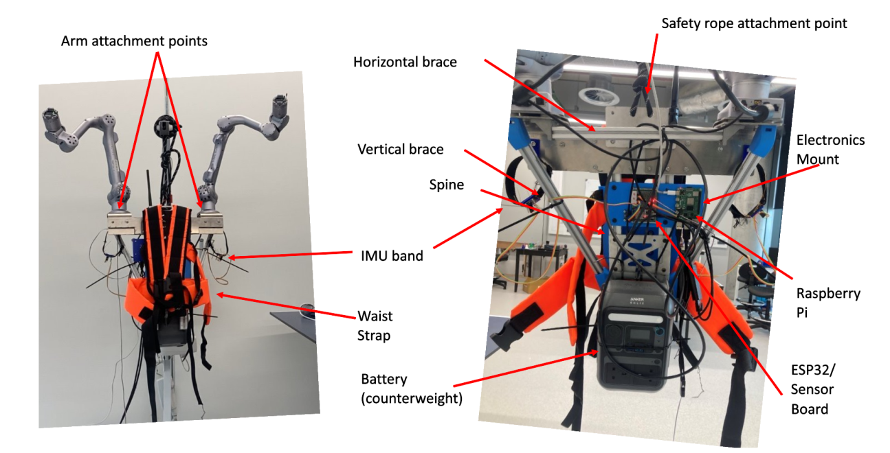
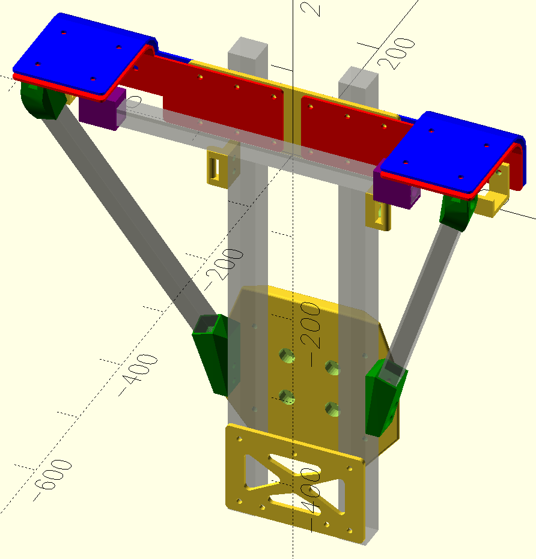
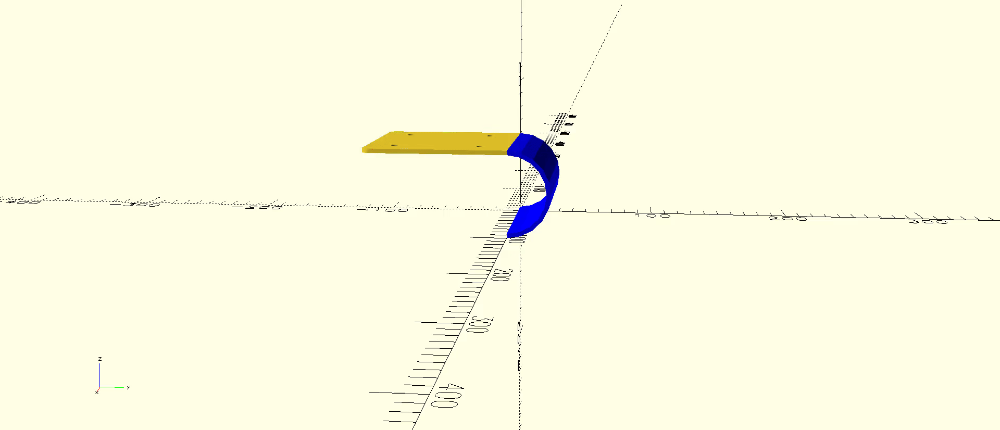

# chimera-cad

CAD files for the Chimera Project, implemented in openscad. If you run into issues, try `openscad-nightly` as openscad hasn't had an official release in over four years.

In addition to the part files, it also contains two utilities which may be useful more generally;

- `sweep-extrude.scad`, similar to a regular extrude  but allowing a stepped rotation towards a target position over the extrusion. This was used to align the brace adapters (green components in the above image) towards each other
- `stepped_bend`, which automates flattening of bent sheet metal parts for production (see below)

